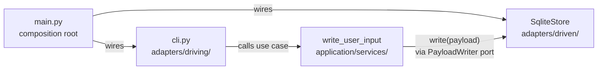

# Hexagonal Architecture (Ports & Adapters)

Minimal ports-and-adapters project: one port, two driven adapters (SQLite + in-memory),
one driving adapter (CLI), and a composition root that wires them together.

## Project structure

```
HexagonalArchitecture/
    domain/                              # Innermost — depends on nothing
        transform.py                     #   Payload dataclass
    application/                         # Middle — depends on domain only
        ports/                           #   Port interfaces (Protocols)
            ports.py                     #     PayloadWriter
        services/                        #   Use cases / orchestration
            memo_use_cases.py            #     write_user_input()
            tests/
                test_write_user_input.py #     Tests the use case with in-memory mock
    adapters/                            # Outermost — depends on domain + application
        driving/                         #   LEFT side (primary) — drives the app
            cli.py                       #     CLI user interaction
            tests/
                test_cli.py              #     Tests the CLI adapter
        driven/                          #   RIGHT side (secondary) — app drives these
            in_memory_store.py           #     Test double (mock)
            sqlite_store.py              #     Real persistence
            tests/
                test_sqlite_store.py     #     Tests the SQLite adapter
    main.py                              # Composition root — wires everything
    __main__.py                          # Entry point: python -m HexagonalArchitecture
    example/                             # Standalone demo scripts
        with_hexagonal.py                #   Discount calculator (hexagonal)
        without_hexagonal.py             #   Discount calculator (no hexagonal)
```

## Run

```bash
python3 main.py
```

## Tests

```bash
python3 -m pytest adapters/driven/tests/ adapters/driving/tests/ application/services/tests/ -v
```

## Architecture

Based on Alistair Cockburn's Hexagonal Architecture (2005) combined with
Clean Architecture layering.

### Dependency direction

```
domain/        ← depends on nothing
application/   ← depends on domain
adapters/      ← depends on domain + application
main.py        ← depends on everything (wiring only)
```

Dependencies flow **inward**. The center never imports from outer layers.

### Ports and adapters

- **Ports** — Abstract interfaces in `application/ports/` (`PayloadWriter`).
  They describe what the application needs, not how it is done.
- **Driving adapters** (primary, left side) — Things that call INTO the
  application: `adapters/driving/cli.py`, test harnesses.
- **Driven adapters** (secondary, right side) — Things the application calls
  OUT to: `adapters/driven/sqlite_store.py`, `adapters/driven/in_memory_store.py`.
- **Composition root** — `main.py` is the only place that knows about concrete
  adapters. It wires a driven adapter to a driving adapter through the port.

### Why this shape

- Swap storage or integrations without rewriting core logic.
- Test use cases with fakes or in-memory adapters — no real DB needed.
- Clear map of where code belongs.

## Folder guide

### `domain/` — domain model and pure logic

**Purpose:** Types and functions that express business rules with no I/O.

**What belongs here:** Dataclasses (e.g. `Payload`), value types, business rules.

**What does not belong:** Imports from `application/` or `adapters/`. Any I/O.

### `application/` — use cases and ports

**Purpose:** Orchestrates what the system does. Defines ports as abstract interfaces.

- `ports/` — Port interfaces (`PayloadWriter` Protocol).
- `services/` — Use cases that orchestrate domain objects through ports.

**What does not belong:** Concrete I/O implementations (those live in `adapters/`).

### `adapters/` — infrastructure (outside the hexagon)

**Purpose:** Implements ports with concrete technology.

- `driving/` — Primary adapters that **drive** the application (CLI, GUI, HTTP controllers, test harnesses).
- `driven/` — Secondary adapters that the application **drives** (databases, file systems, external APIs).

### `main.py` — composition root

The only file that knows about both concrete adapters and the application layer.
It wires them together and starts the program. It has no business logic.

## How to add code and keep separation

1. **New business rules or data shapes** → put in `domain/`. Never import
   `application/` or `adapters/` from here.
2. **New workflow** → add/extend functions in `application/services/`. Depend on
   `domain/` and port types from `application/ports/`, not concrete adapters.
3. **New external capability** → declare a `Protocol` in `application/ports/`,
   use it from `application/services/`, implement it in `adapters/driven/`.
4. **New way to drive the app** (GUI, HTTP, batch) → add to `adapters/driving/`.
5. **Wire new adapters** → update `main.py`.

### Application flow


